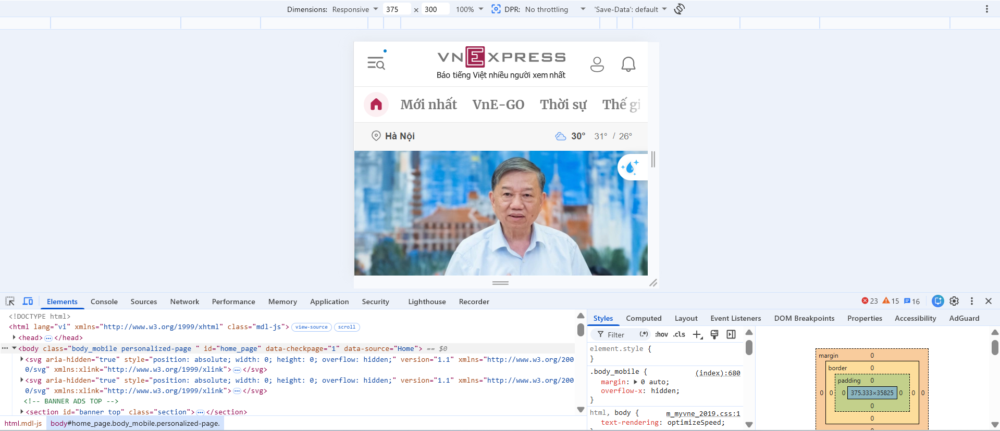
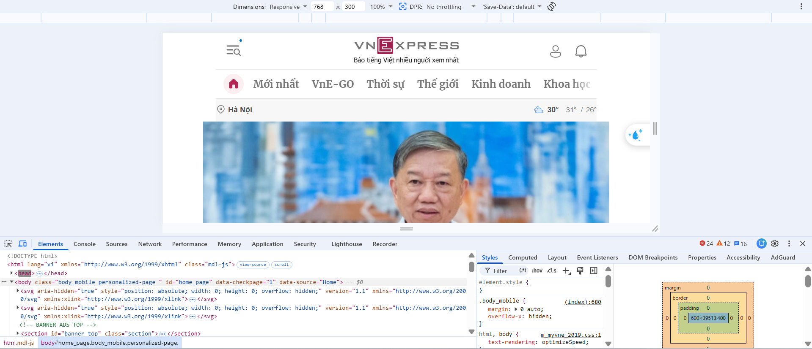
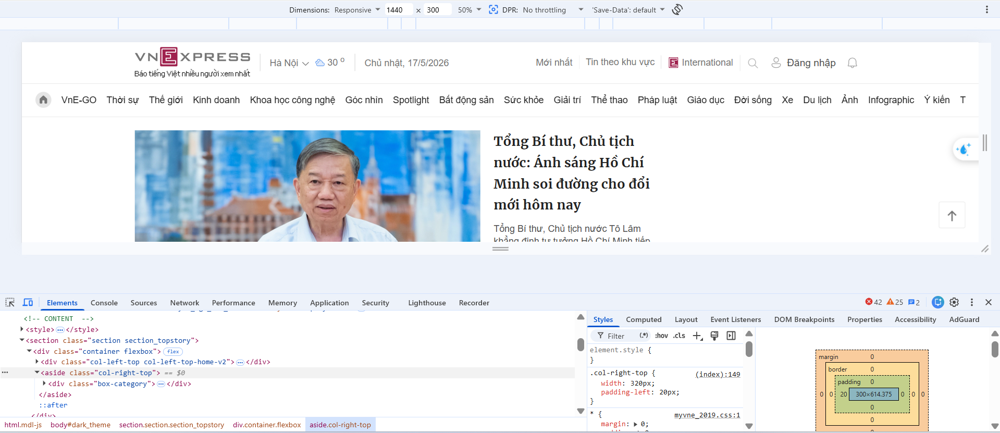
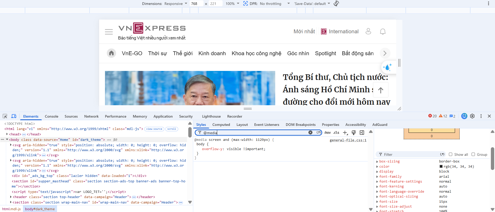

# Phần A: Kiểm tra đọc hiểu

## Câu A1 — Viewport & Mobile-First

1. Cấu trúc chuẩn của thẻ `<meta viewport>`

```html
<meta name="viewport" content="width=device-width, initial-scale=1.0" />
```

_Thành phần và chức năng_

- `name="viewport"`: Thông báo cho trình duyệt rằng đây là thiết lập quản lý viewport (vùng hiển thị của trang).
- `content`: Lưu trữ các thông số cấu hình, được phân tách bằng dấu phẩy.
- `width=device-width`: Đặt chiều rộng viewport bằng chiều rộng của thiết bị (ví dụ: iPhone 14 có chiều rộng 390px). Nếu không có, trình duyệt sẽ mặc định sử dụng ~980px và thu nhỏ nội dung.
- `initial-scale=1.0`: Xác định tỷ lệ phóng to ban đầu ở mức 100%, tránh zoom tự động.

2. Hậu quả khi thiếu thẻ `<meta viewport>`

Khi thẻ này vắng mặt, iPhone sẽ coi trang web là nội dung desktop tiêu chuẩn và sẽ tiến hành thu nhỏ toàn bộ để phù hợp với màn hình. Điều này gây ra những vấn đề sau:

- Văn bản và nội dung trở nên quá nhỏ, người dùng buộc phải phóng to để đọc được
- Cần cuộn ngang liên tục vì viewport mặc định (980px) vượt quá chiều rộng màn hình (375-430px)
- Các phần tử tương tác như nút bấm bị chồng chéo, gây khó khăn trong việc sử dụng
- Hình ảnh được thiết kế cho desktop sẽ tràn ra ngoài màn hình thiết bị di động

3. So sánh phương pháp Mobile-First và Desktop-First với CSS. Giải thích tại sao Mobile-First được khuyến cáo?

- **Phương pháp Mobile-First** (khuyến khích sử dụng) — sử dụng `min-width`

```css
/* Cơ sở: quy tắc CSS cho thiết bị di động */
.container {
  display: flex;
  flex-direction: column;
}

.sidebar {
  display: none;
}
.main-content {
  width: 100%;
}

/* Khi kích thước >= 768px (máy tính bảng trở lên) */
@media (min-width: 768px) {
  .container {
    flex-direction: row;
    gap: 24px;
  }
  .sidebar {
    display: block;
    width: 200px;
  }
  .main-content {
    width: calc(100% - 200px - 24px);
  }
}
```

Cấu trúc: Thiết bị di động hiển thị 1 cột và sidebar bị ẩn. Từ máy tính bảng trở lên, chuyển thành 2 cột và hiện sidebar.

- **Phương pháp Desktop-First** (phương pháp cũ) — sử dụng `max-width`

```css
/* Cơ sở: quy tắc CSS cho máy tính để bàn */
.container {
  display: flex;
  flex-direction: row;
  gap: 24px;
}

.sidebar {
  display: block;
  width: 200px;
}
.main-content {
  width: calc(100% - 200px - 24px);
}

/* Khi kích thước < 768px (thiết bị di động) */
@media (max-width: 768px) {
  .container {
    flex-direction: column;
    gap: 0;
  }
  .sidebar {
    display: none;
  }
  .main-content {
    width: 100%;
  }
}
```

Cấu trúc: Máy tính để bàn hiển thị 2 cột. Khi kích thước giảm xuống dưới 768px, chuyển thành 1 cột và ẩn sidebar.

- **Lý do Mobile-First được ưu tiên:**
  - Trên thiết bị di động, chỉ tải CSS cơ sở (dành cho di động) và bỏ qua media query `min-width`, tiết kiệm lượng dữ liệu và tăng tốc độ tải.
  - Phương pháp Desktop-First có xu hướng ngược lại: thiết bị di động phải tải toàn bộ CSS cho desktop trước, rồi mới ghi đè bằng `max-width` → lãng phí tài nguyên.
  - Xét theo thống kê, 60% lưu lượng web đến từ thiết bị di động, vì vậy ưu tiên di động trước = phục vụ đúng đối tượng người dùng chính.
- Code dễ đọc hơn: thêm styles theo thứ tự từ nhỏ đến lớn, ít xung đột hơn.

## Câu A2 — Breakpoints

| Tên | Kích thước | Thiết bị         | Lưới sản phẩm |
| --- | ---------- | ---------------- | ------------- |
| xs  | < 576px    | Điện thoại dọc   | 1 cột         |
| sm  | ≥ 576px    | Điện thoại ngang | 2 cột         |
| md  | ≥ 768px    | Tablet           | 2 cột         |
| lg  | ≥ 992px    | Desktop nhỏ      | 3-4 cột       |
| xl  | ≥ 1200px   | Desktop lớn      | 4 cột         |

## Câu A3 — Media Queries

| Chiều rộng màn hình | `.container` width |
| ------------------- | ------------------ |
| 375px (iPhone SE)   | 100% (= 375px)     |
| 600px               | 540px              |
| 800px               | 720px              |
| 1000px              | 960px              |
| 1400px              | 1140px             |

## Câu A4 — SCSS Basics

1. Variables (`$primary-color`)

- Cho phép lưu giá trị dùng chung (màu, font, kích thước) vào một biến, cần đổi thì chỉ sửa 1 chỗ.

```scss
$primary: #805ad5;
$danger: #e53e3e;
$font-body: "Inter", sans-serif;
$radius: 8px;

.btn-primary {
  background: $primary;
  border-radius: $radius;
}

.header {
  background: $primary; // Đổi $primary = 2 chỗ tự đổi
}
```

- Lợi ích: Đổi màu chủ đạo từ xanh sang tím, chỉ cần sửa biến thay vì sửa nhiều chỗ.

2. Nesting (viết CSS lồng nhau)

- Cho phép viết CSS theo cấu trúc lồng nhau giống HTML, code gọn và dễ đọc hơn.

```scss
.navbar {
  background: #1a202c;
  padding: 16px;

  ul {
    list-style: none;
    display: flex;

    li {
      margin-right: 24px;

      a {
        color: white;

        &:hover {
          // & = chính thẻ a
          color: $primary;
        }
      }
    }
  }
}
```

- Biểu tượng `&` đại diện cho thẻ cha (ở đây là `a`), nên `&:hover` sẽ ra `.navbar ul li a:hover`.
- Quy tắc: Không lồng quá 3 cấp, sâu hơn thì selector dài, khó maintain.

3. Mixins (`@mixin`, `@include`)

- Mixin là đoạn CSS có thể tái sử dụng nhiều nơi. Dùng `@mixin` để khai báo, `@include` để gọi.

```scss
// Khai báo mixin
@mixin flex-center {
  display: flex;
  justify-content: center;
  align-items: center;
}

// Sử dụng
.hero {
  @include flex-center;
  height: 100vh;
}
```

- Lợi ích: Không phải viết lặp đi lặp lại đoạn CSS giống nhau.

4. `@extend` / Inheritance

- Cho phép một selector kế thừa toàn bộ CSS từ selector khác, tránh lặp code.

```scss
// Base (cha)
.btn {
  padding: 12px 24px;
  border: none;
  border-radius: $radius;
  cursor: pointer;
  font-weight: 600;
  transition: all 0.3s ease;
}

// Kế thừa + thêm style riêng
.btn-primary {
  @extend .btn;
  background: $primary;
  color: white;
}

.btn-danger {
  @extend .btn;
  background: $danger;
  color: white;
}
```

- Khác với mixin: `@extend` tạo ra một nhóm selector chung trong CSS đầu ra (nhẹ hơn). Mixin thì sao chép đoạn CSS vào mỗi nơi gọi (dễ hơn nhưng có thể tạo code trùng lặp).

Tại sao trình duyệt KHÔNG đọc được file `.scss`? Cần bước gì để chuyển SCSS → CSS?

- SCSS (Sassy CSS) là CSS preprocessor — tức là CSS có thêm tính năng lập trình (biến, hàm, lồng nhau, điều kiện). Đây là cú pháp mở rộng, trình duyệt chỉ hiểu CSS thuần, nên không thể đọc trực tiếp file `.scss`.

- Quá trình chuyển đổi: SCSS (code viết) → Compiler (dịch) → CSS (trình duyệt đọc)


# Phần B: Thực hành code

## Bài B3 — SCSS Refactor

- Lệnh compile SCSS → CSS

```bash
# Cài sass (chưa có)
npm install -g sass

# Compile file style.scss ra style-compiled.css
sass scss/style.scss style-compiled.css

# Hoặc watch (tự compile khi lưu)
sass --watch scss/style.scss style-compiled.css

# Với VS Code: cài extension "Live Sass Compiler" → click "Watch Sass"
```

# Phần C: Phân tích

## Câu C1 — Phân tích trang web thực

### Mobile (375px)



1. Navigation thay đổi thế nào?

- Icon hamburger + kính lúp xuất hiện ở góc trái thay thế menu ngang
- Logo giữ nguyên ở giữa
- Góc phải chỉ còn icon user + bell
- Category bar (Mới nhất, VnE-GO, Thời sự...) chuyển sang dạng scroll ngang, không wrap xuống dòng

2. Lưới content thay đổi mấy cột?

- Chuyển về 1 cột duy nhất
- Ảnh bài viết chiếm 100% chiều rộng container

3. Elements nào bị ẩn trên mobile?

- Sidebar phải (`.col-right-top`) — ẩn qua `display: none`
- Menu ngang desktop (thay bằng hamburger)

4. Font size có thay đổi không?

- Có — tiêu đề category nhỏ hơn so với desktop
- Thanh thời tiết (Hà Nội 30°) và navigation text dùng font size vừa phải, vẫn readable

### Tablet (768px)



1. Navigation thay đổi thế nào?

- Vẫn giữ hamburger + kính lúp ở góc trái (giống mobile)
- Logo giữ nguyên ở giữa, to hơn so với 375px
- Category bar hiển thị nhiều mục hơn (Mới nhất, VnE-GO, Thời sự, Thế giới, Kinh doanh, Khoa học...)
- Vẫn scroll ngang, chưa phải full menu ngang như desktop

2. Lưới content thay đổi mấy cột?

- Vẫn 1 cột chính — chưa có sidebar
- Ảnh hero chiếm toàn bộ chiều rộng

3. Elements nào bị ẩn/hiện so với mobile?

- Ngày âm lịch xuất hiện (ẩn ở 375px, hiện ở 768px)
- Category bar hiện nhiều mục hơn do có thêm không gian

4. Font size có thay đổi không?

- Có tăng nhẹ — tiêu đề category và text rõ ràng hơn
- Ảnh hero lớn hơn đáng kể (600px vs ~460px ở mobile)
- Tổng thể scale theo chiều rộng, không có breakpoint riêng cho tablet

### Desktop (1440px)



1. Navigation thay đổi thế nào?

- Hamburger biến mất → menu ngang đầy đủ hiển thị
- Header có thêm: Địa điểm, thời tiết
- Góc phải: nút Đăng nhập, icon search, bell — rõ ràng hơn hẳn
- Category bar hiện toàn bộ danh mục

2. Lưới content thay đổi mấy cột?

- Chuyển sang 2 cột: ảnh trái + tiêu đề/tóm tắt bài viết bên phải
- `.col-right-top` xuất hiện trở lại (width: 320px, padding-left: 20px)
- Layout dùng Flexbox (`container flexbox`)

3. Elements xuất hiện lại ở Desktop

- Sidebar phải (`.col-right-top`) — width: 320px
- Thông tin địa điểm + thời tiết trên header
- Nút Đăng nhập text (mobile chỉ có icon)
- Toàn bộ category không cần scroll ngang

4. Font size có thay đổi không?

- Tăng rõ rệt — tiêu đề bài viết to và đậm hơn hẳn



## Câu C2 — Thiết kế Responsive Strategy

## MOBILE (375px)

```
+-----------------------------+
| ☰  LOGO              [📞]  |
+-----------------------------+
|                             |
|         HERO IMAGE          |
|                             |
+-----------------------------+
|   [Anh 1]   |   [Anh 2]    |
+-------------+---------------+
|   [Anh 3]   |   [Anh 4]    |
+-------------+---------------+
|   [Anh 5]   |   [Anh 6]    |
+-----------------------------+
|                             |
|  FORM DAT BAN               |
|  +------------------------+ |
|  | Ngay                   | |
|  +------------------------+ |
|  | Gio                    | |
|  +------------------------+ |
|  | So nguoi               | |
|  +------------------------+ |
|  | Ghi chu                | |
|  |                        | |
|  +------------------------+ |
|                             |
|   [    DAT BAN NGAY    ]    |
|                             |
+-----------------------------+
|                             |
|       GOOGLE MAPS           |
|                             |
+-----------------------------+
|           FOOTER            |
+-----------------------------+
```

Ẩn trên mobile:

- Nav links (thay bằng ☰ hamburger)
- Sidebar thông tin
- Số điện thoại dạng text (chỉ icon 📞)

## TABLET (768px)

```
+---------------------------------------------+
| ☰  LOGO                   📞 0901 234 567  |
+---------------------------------------------+
|                                             |
|                HERO IMAGE                   |
|                                             |
+---------------+---------------+-------------+
|   [Anh 1]     |   [Anh 2]     |   [Anh 3]  |
+---------------+---------------+-------------+
|   [Anh 4]     |   [Anh 5]     |   [Anh 6]  |
+---------------------+-----------------------+
|  FORM DAT BAN       |                       |
|  +-----------------+|   GOOGLE MAPS         |
|  | Ngay            ||                       |
|  +-----------------+|                       |
|  | Gio             ||                       |
|  +-----------------+|                       |
|  | So nguoi        ||                       |
|  +-----------------+|                       |
|  | Ghi chu         ||                       |
|  |                 ||                       |
|  +-----------------+|                       |
|  [ DAT BAN NGAY ]   |                       |
+---------------------+-----------------------+
|                   FOOTER                    |
+---------------------------------------------+
```

- Grid ảnh: 2 cột → 3 cột
- Form + Bản đồ: dọc → nằm cạnh nhau (2 cột)
- Bản đồ: nằm bên phải form, cùng chiều cao
- Số điện thoại hiện text đầy đủ

## DESKTOP (1440px)

```
+----------------------------------------------------------------+
| LOGO    Trang chu   Menu   Lien he         📞 0901 234 567     |
+----------------------------------------------------------------+
|                                                                |
|                        HERO IMAGE                              |
|                                                                |
+------------------------------------------------+---------------+
|                                                |               |
|  +------------+ +------------+ +------------+  |  SIDEBAR      |
|  |  [Anh 1]   | |  [Anh 2]   | |  [Anh 3]   |  |               |
|  +------------+ +------------+ +------------+  |  Gio mo cua:  |
|  +------------+ +------------+ +------------+  |  T2-T6: 10-22h|
|  |  [Anh 4]   | |  [Anh 5]   | |  [Anh 6]   |  |  T7-CN: 9-23h |
|  +------------+ +------------+ +------------+  |               |
|                                                |  Dia chi:     |
|  +--------------------+  +------------------+  |  236 Tay Son  |
|  | FORM DAT BAN       |  |                  |  |               |
|  | +--------+-------+ |  |                  |  |  Danh gia:    |
|  | | Ngay   | Gio   | |  |  GOOGLE MAPS     |  |  4.8/5 (320)  |
|  | +--------+-------+ |  |                  |  |               |
|  | | So nguoi       | |  |                  |  +---------------+
|  | +-----------------+|  |                  |
|  | | Ghi chu        | |  |                  |
|  | |                | |  +------------------+
|  | +-----------------+|
|  | [ DAT BAN NGAY ]   |
|  +--------------------+
+------------------------------------------------+
|  Logo | Lien he | Chinh sach | MXH | © 2025   |
+----------------------------------------------------------------+
```

- Nav links: hiện đầy đủ (bỏ hamburger)
- Sidebar: xuất hiện bên phải (giờ mở cửa, địa chỉ, đánh giá)
- Form: Ngày + Giờ nằm cùng 1 hàng (2 input inline)
- Footer: đa cột thay vì 1 cột

# CSS skeleton

```css
/* ======================
   MOBILE FIRST
====================== */

body {
  margin: 0;
}

.container {
  display: grid;
  gap: 20px;
  padding: 20px;
}

/* Header */
.header {
  display: grid;
  grid-template-columns: 1fr auto;
}

/* Hero */
.hero {
  min-height: 300px;
}

/* Food grid */
.food-grid {
  display: grid;
  grid-template-columns: 1fr;
  gap: 15px;
}

/* Booking form */
.booking-form {
  display: grid;
  gap: 10px;
}

/* Google map */
.map iframe {
  width: 100%;
  height: 300px;
}

/* Footer */
.footer {
  text-align: center;
}

/* ======================
   TABLET
====================== */

@media (min-width: 768px) {
  .food-grid {
    grid-template-columns: repeat(2, 1fr);
  }

  .hero {
    min-height: 400px;
  }
}

/* ======================
   DESKTOP
====================== */

@media (min-width: 1024px) {
  .content-layout {
    display: grid;
    grid-template-columns: 2fr 1fr;
    gap: 30px;
  }

  .food-grid {
    grid-template-columns: repeat(3, 1fr);
  }

  .hero {
    min-height: 500px;
  }
}
```